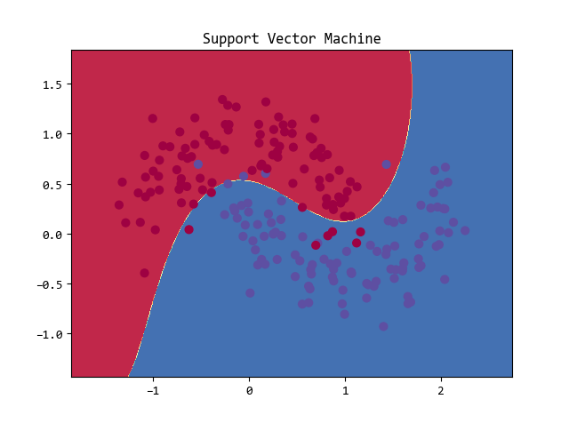

# plume
plume，一个轻量级机器学习库。包含常见机器学习算法的Python实现。


## 解决依赖
* Python >= 3.6
* NumPy
* SciPy


## 快速入门
Input:
```python
from plume.utils import plot_decision_boundary
from plume.svm import SVC

X, y = sklearn.datasets.make_moons(200, noise=0.20)
y = 2 * y - 1
clf = SVC(C=3, kernel='rbf')
clf.fit(X, y)
plot_decision_boundary(clf.predict, X, y, 'Support Vector Machine')
```
Output:

